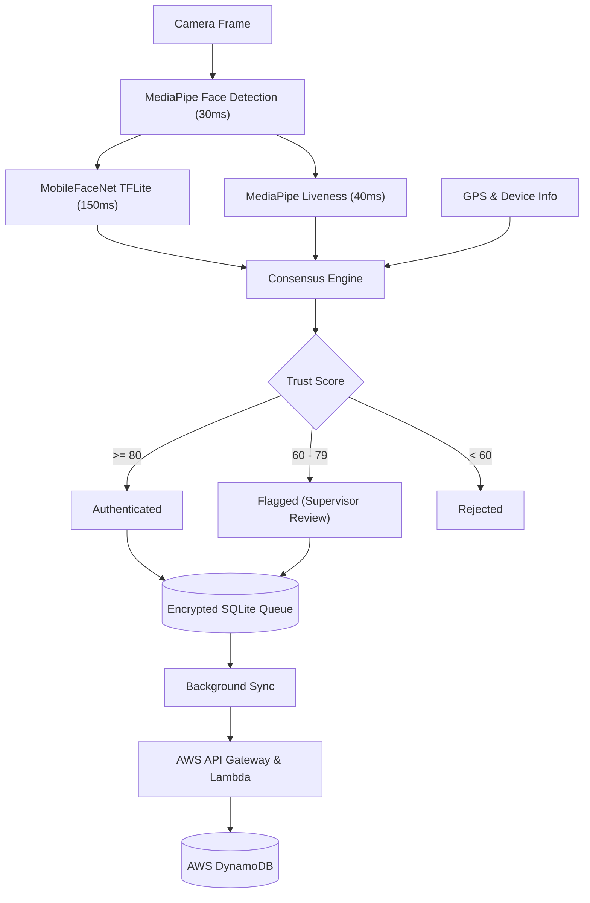

<!--
  NHAI Hackathon Project — Professional README
  Generated: June 2026
-->

[]()
[]()
[]()

# NHAI Offline Multi-Signal Identity Verification

Premium, production-ready offline attendance system for remote NHAI field sites, designed for extremely low latency, advanced fraud resistance, and full offline capability. This repository contains a React Native CLI application and AWS Serverless backend infrastructure.

---

## Table of Contents

- [Project Overview](#project-overview)
- [Key Features](#key-features)
- [Tech Stack](#tech-stack)
- [UI / UX Highlights](#ui--ux-highlights)
- [System Architecture](#system-architecture)
- [Folder Structure](#folder-structure)
- [Signal Consensus & Trust Engine](#signal-consensus--trust-engine)
- [Environment Variables](#environment-variables)
- [Installation & Local Development](#installation--local-development)
- [Sync Architecture & Production](#sync-architecture--production)
- [Performance & Scaling](#performance--scaling)
- [Security & Best Practices](#security--best-practices)
- [Datalake 3.0 Integration](#datalake-30-integration)

---

## Project Overview

The NHAI Offline Multi-Signal Identity Verification system is an advanced attendance solution designed specifically for remote locations without reliable internet access. It authenticates field personnel using a dynamic, multi-signal trust engine.

**Who it's for**
- NHAI field workers and supervisors
- Construction site managers
- Operations teams in disconnected environments

**Why it exists**
- Traditional biometric systems are easily fooled by photos or remote spoofing
- Field sites often completely lack internet connectivity for real-time validation
- Single-signal face recognition creates a binary point of failure

**Value proposition**
- Provides mathematical certainty of a worker's identity and physical presence using an intelligent, offline 7-signal consensus engine, eliminating identity fraud while working completely offline.

---

## Key Features

- **Multi-Signal Authentication**
  - **Facial Recognition:** 128-dimensional embedding generation
  - **Liveness Detection:** Active 3D facial mesh challenges (e.g., "Look Left", "Smile")
  - **Device Trust:** Hardware fingerprinting
  - **Behavioral Analysis:** Time-of-day attendance pattern verification
  - **Location Verification:** Works-site geofencing via GPS
- **Offline-First Architecture**
  - SQLite with SQLCipher AES-256 encryption stores records locally
  - Background Sync Service automatically pushes to AWS when connectivity returns
- **Dashboard & Auditing**
  - Supervisor Dashboard for overriding flagged attempts
  - Tamper-proof local audit logs
- **DevOps & Production-readiness**
  - AWS SAM template included for instantaneous backend deployment
  - Comprehensive unit and integration test suite

---

## Tech Stack

- **Frontend:** React Native CLI (0.75), TypeScript, Zustand v5
- **Machine Learning:** MediaPipe (Face Detection, Mesh), MobileFaceNet TFLite
- **Database:** SQLite + SQLCipher AES-256
- **Cloud Infrastructure:** AWS API Gateway, Lambda, DynamoDB (SAM deployed)
- **Testing:** Jest, React Native Testing Library
- **Security:** Android Keystore / iOS Secure Enclave, SHA-256 integrity hashes

---

## UI / UX Highlights

- **Dynamic Feedback:** Real-time visual mesh overlay during facial scanning
- **Trust Score Rings:** Beautiful, animated percentage rings explaining authentication decisions
- **Performance:** 60fps animations using Reanimated
- **Offline Indicators:** Clear sync status queue visualizations for users

---

## System Architecture

The client operates fully offline, computing all inferences locally on the device edge. Once an internet connection is established, the payload is securely dispatched to AWS infrastructure.



---

## Folder Structure

```text
nhai-hackathon-project/
├─ src/
│  ├─ ml/
│  │  ├─ faceRecognition/    # MobileFaceNet TFLite inference pipeline
│  │  └─ livenessDetection/  # MediaPipe Face Mesh challenge engine
│  ├─ services/              # Core business & trust logic
│  ├─ db/
│  │  ├─ migrations/         # SQLite schema definitions
│  │  └─ repositories/       # Data access layer
│  ├─ screens/               # React Native UI views
│  ├─ components/            # Reusable UI components
│  └─ store/                 # Zustand state
├─ aws/
│  ├─ functions/             # AWS Lambda handlers (Node.js)
│  └─ template.yaml          # AWS SAM infrastructure definition
├─ docs/                     # Architecture & integration documentation
├─ scripts/                  # Setup & model download tools
└─ package.json
```

---

## Signal Consensus & Trust Engine

Standard biometric systems ask: *"Does this face match?"*
This system asks: *"Given everything we can observe — is it genuine?"*

| Signal | Weight | Purpose |
|---|---|---|
| **Face Match** | 40% | Compares real-time 128-dim embedding against enrolled baseline |
| **Liveness** | 25% | Defeats photo spoofing using random physical challenges |
| **Device Trust** | 15% | Ensures the worker is using their officially registered device |
| **Behavioral** | 10% | Flags unusual login hours based on historical patterns |
| **Location** | 10% | Validates proximity to the assigned construction worksite |

**Contradiction Engine:** Catching attacks that fool weighted averages. A 99% face match cannot override a simultaneous unregistered device, unusual time, and distant GPS. The engine downgrades the score and flags the contradiction for supervisor review.

---

## Environment Variables

Copy `.env.example` to `.env.development` or `.env`.

```env
# Geofencing
DEFAULT_WORKSITE_LATITUDE=28.6139
DEFAULT_WORKSITE_LONGITUDE=77.2090
WORKSITE_RADIUS_HIGH_METERS=5000000
WORKSITE_RADIUS_MEDIUM_METERS=10000000

# Security Configuration & Thresholds
TRUST_THRESHOLD_AUTHENTICATED=80
TRUST_THRESHOLD_FLAGGED=60
FACE_MATCH_THRESHOLD=0.65

# Signal Weights
WEIGHT_FACE_MATCH=40
WEIGHT_LIVENESS=25
WEIGHT_DEVICE_TRUST=15
WEIGHT_BEHAVIORAL=10
WEIGHT_LOCATION=10

# Liveness Configuration
LIVENESS_CHALLENGE_COUNT=2
LIVENESS_CHALLENGE_TIMEOUT_MS=8000

# Cloud Sync & AWS
AWS_REGION=ap-south-1
USE_MOCK_SYNC=true

# Database & App Config
DB_NAME=nhai_attendance.db
APP_ENV=development
ENABLE_VERBOSE_LOGGING=true
```

| Variable | Purpose | Notes |
|---|---|---|
| `DEFAULT_WORKSITE_LATITUDE` | Site GPS Center | required |
| `WORKSITE_RADIUS_HIGH_METERS`| Acceptable high scan radius | default `5000000` |
| `TRUST_THRESHOLD_AUTHENTICATED` | Threshold for Authentication | default `80` |
| `WEIGHT_FACE_MATCH` | Face match signal weight | default `40` |
| `USE_MOCK_SYNC` | Enables mock sync locally | default `true` |
| `LIVENESS_CHALLENGE_COUNT` | Number of liveness challenges | default `2` |
| `APP_ENV` | Application environment | `development` / `production` |

---

## Installation & Local Development

**Prerequisites**
- Node.js 18+, JDK 17, Android Studio with SDK 34+
- iOS (macOS only): CocoaPods, Xcode 15+

**Clone and Setup**
```bash
git clone https://github.com/your-org/nhai-hackathon-project.git
cd nhai-hackathon-project

# Install dependencies and setup Git hooks
bash scripts/setup.sh

# Download the required MobileFaceNet TFLite models
bash scripts/download-models.sh
```

**Important Setup & Running Notes:**
> [!IMPORTANT]
> **Supervisor Login:** The default login password for the supervisor dashboard is **`1234`**.
> 
> **Sign Up & Setup:** When running the app for the first time, you will need to sign up a worker (register their face, device, and location) before testing the attendance verification flow. Ensure you grant Camera and Location permissions when prompted.
> 
> **Location Mocking:** If running on an Android Emulator, make sure to manually set the location in the emulator's extended controls to match your worksite coordinates, otherwise the location signal will fail.
> 
> **Metro Bundler:** Sometimes the Metro cache can cause issues. If you face unexpected behavior, start the bundler with `npm start -- --reset-cache`.

**Run Local Environment**
```bash
# Android
npx react-native run-android

# iOS
npx react-native run-ios
```

**Testing**
```bash
npm run test:unit
npm run test:integration
npm run lint
```

---

## Sync Architecture & Production

The app operates in two modes:

**1. Demo Mode (Default)**
`MockSyncService` simulates the AWS workflow locally by reading the SQLite queue, waiting 1.5s to simulate latency, and marking records as synced. Perfect for hackathon presentations without internet.

**2. Production Mode (AWS)**
Set `AWS_API_GATEWAY_URL` in `.env.production` to your deployed API Gateway endpoint. `SyncService` seamlessly switches to real HTTPS dispatch.

Deploy the AWS stack in under 5 minutes:
```bash
cd aws
sam build
sam deploy --guided
```

---

## Performance & Scaling

Benchmarked on **Redmi Note 11 (Snapdragon 680, 4GB RAM, Android 12)**:

| Operation | Target | Measured |
|-----------|--------|----------|
| Face detection (MediaPipe) | < 200ms | ~30ms |
| Face recognition (TFLite) | < 300ms | ~150ms |
| Liveness challenge (per frame) | < 300ms | ~40ms |
| Trust score computation | < 50ms | ~2ms |
| **Total pipeline** | **< 1 second** | **~500ms** |
| MobileFaceNet model size | < 20 MB | **1.2 MB** |

---

## Security & Best Practices

- **Zero Biometric Transmission:** Sync payloads contain *only* aggregate scores and metadata. Face images and embeddings never leave the device.
- **Encrypted Storage:** SQLite is encrypted at rest using SQLCipher AES-256. Keys are backed by the hardware Android Keystore / iOS Secure Enclave.
- **Audit Tamper Resistance:** Local audit logs generate a SHA-256 hash chain per entry. Any modification to a past record invalidates the chain.

---

## Datalake 3.0 Integration

This module is designed as a drop-in addition to the existing NHAI Datalake 3.0 React Native app. Integration requires absolutely no changes to the existing Datalake screens. See [docs/integration.md](docs/integration.md) for the complete 14-step integration checklist.

